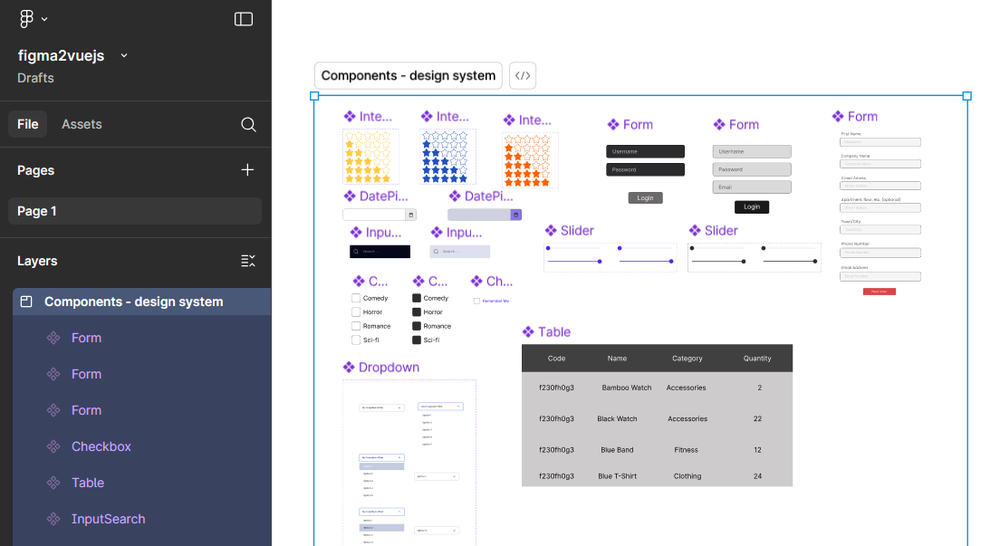
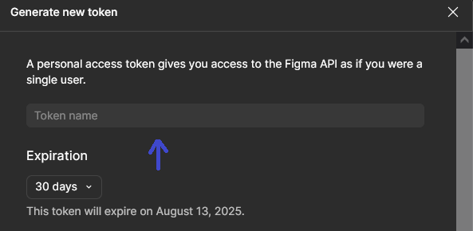
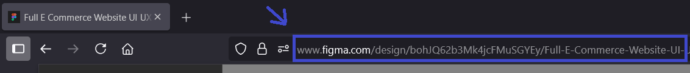
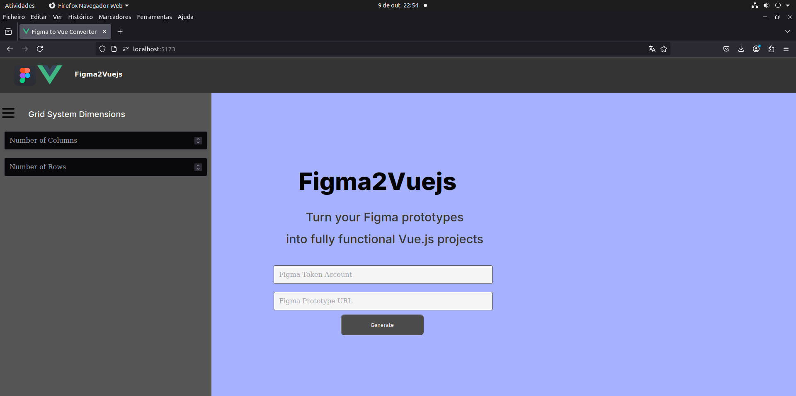
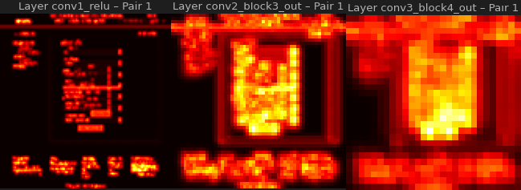
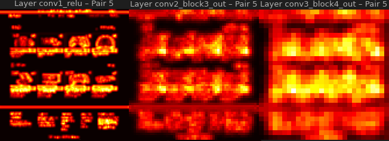
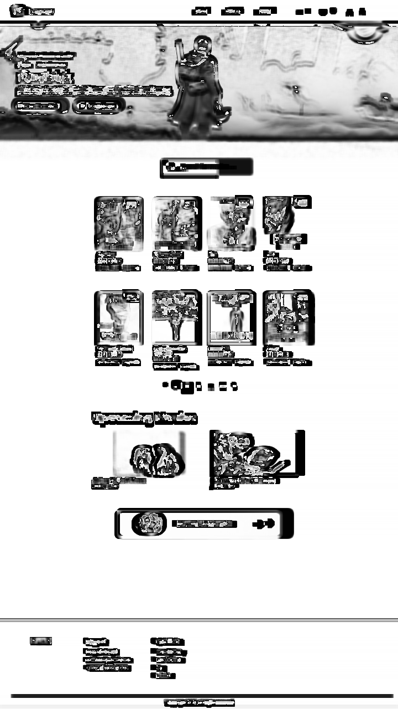
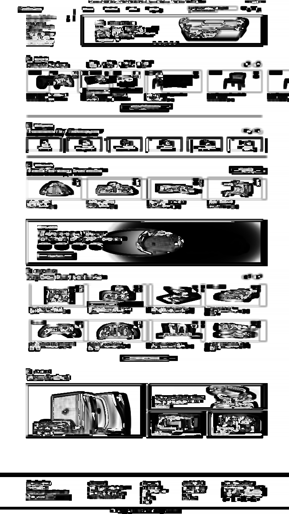
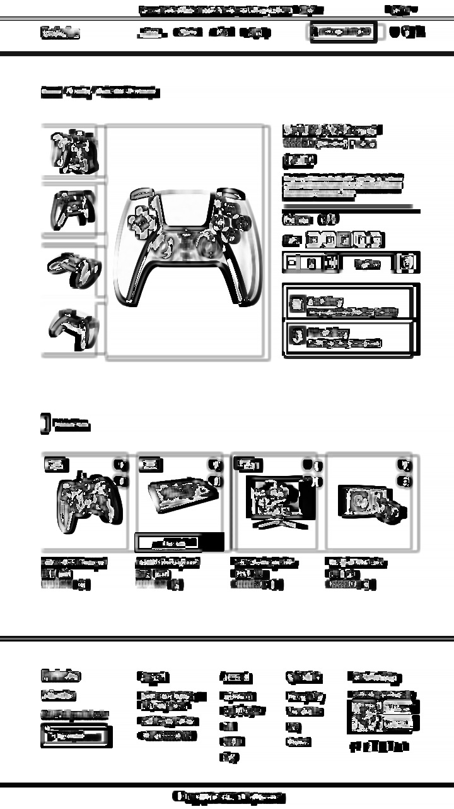

# figma2vuejs

 

figma2vuejs is a tool that generates front-end Vue.js code projects from Figma prototypes of the user interface. The aim of this approach is to generate code that can be easily integrated into the overall application development, reducing therefore the gap between the design phase and the implementation phase.

## Nomenclatures and component-based prototyping
### Instructions

Since frames in the first level of the Figma artboard could represent state variations, such as hovering or overlay elements, it was created a nomenclature to consider a given Frame as a Vue page. Follow these instructions to obtain a correct coversion according to the context given:

- *Concatenate the annotation "#Page" at the end of a Frame's node name to convert it as a Vue page.*

These are the following components from our design-system that you can import to your Figma prototypes (the component's nomenclatures are reserved) to explore better logic implementation on the final Vue.js code (<a href="https://www.figma.com/design/MyaEF410LKOiWImiuWwbUR/figma2vuejs?node-id=0-1&t=Ej93UKX9vtl9Djiy-1">click here</a> to explore and import them). The components from our design system built until now consist on the:
- *InputSearch, DatePicker, Dropdown, ReadOnlyRating, InteractiveRating, Paginator, Form, Checkbox, Menu, Slider, Table.*

After importing you can modify the properties and structure of these design system componentes, however don't modify the node's names, as properties are extracted based on the component type.



## Design and Generatation Flexibility

The tool supports a wide variety of design elements from Figma, as well as their structural organization and behavioral interactions between them. <i>figma2vuejs</i> can map to Vue code the following elements from Figma: 
<ul>
<li>Frames</li>
<li>Groups</li>
<li>Text</li>
<li>Image</li>
<li>Shape Nodes (Rectangle,Line,Star,Ellipse,Pollygon,Arrows)</li>
<li>Icons & Vectors</li>
<li>Prototype Components</li>
<li>Components from the design system presented</li>
<li>Variants</li>
<li>Pen & Pencil</li>
</ul>

## Setup
Setup commands to run the backend
```bash
git clone https://github.com/joaocasr/figma2vuejs
cd figma2vuejs/server/src/ && pip install -r requirements.txt
uvicorn figma2vuejs:app # run backend server
```
Setup commands to run the frontend
```bash
cd figma2vuejs/figma2vuejs/
npm install # node version >= 20.19+
npm run build
npm run preview
```

Generate a Figma token associated with your Figma account (Settings tab).  



Then, copty the URL from the Figma prototype you want to convert.



Finnaly, insert those credentials in the Figma2Vuejs webpage and press generate.  



## Tool Validation (Visual Fidelity)

To objectively measure similarity, a ResNet model was used as a feature extractor. The features derived from the Prototype images and the Generated UI images were compared using two key metrics:

- Cosine Similarity: Measures the angular similarity between feature vectors (how aligned they are in multi-dimensional space). A value closer to 1 indicates higher similarity.

- Euclidean Distance: Measures the distance between the feature vectors. A lower distance indicates higher structural and stylistic fidelity.

The fidelity metrics obtained from our approach were benchmarked against a commercial design-to-code tool to provide external validation:

- Comparison with Anima: Our computed metrics (Cosine Similarity and Euclidean Distance) were compared directly against the results achieved by interfaces generated by Anima.

- SSIM Comparison: Additionally, the Structural Similarity Index (SSIM) was calculated and compared with Anima's SSIM to specifically evaluate the overall perceptual visual quality.

The following images show 2D heatmaps in which each position indicates the magnitude of the feature difference between the pair of webUI and prototype. The brighter regions showed where are the regions where there are more deviations, meanwhile the darker regions showed identical regions.

<div style="display:flex; gap:10px">


</div>


<br>
A visual validation step was implemented to qualitatively inspect for fidelity deviations (rendering errors, incorrect positioning, etc.). This process uses image processing techniques (OpenCV) to:

- Region Detection: Isolate and filter regions of significant change (contours) between images.

- Bounding Box Generation: Draw green bounding boxes over discrepant areas, both in the original prototype (before) and in the generated interface (after).

- Mask Creation: Generate visual artifacts (mask, filled_after) that isolate areas of difference, enabling targeted analysis of code generation engine failures.

| | **Anima** | **figma2vuejs** |
| :--- | :---: | :---: |
| Cosine Similarity | $0.97$ | $0.96$ |
| Euclidean Distance | $0.23$ | $0.27$ |
| SSIM | $0.79$ | $0.81$ |

Here are some imagens showing the structural differences between the generated interfaces and the prototypes. In the following imagens are visible the black deviation regions, showing some spacing errors, some aproximation allocations on the grid and some element size deviations.
<div style="display:flex; gap:10px">





</div>

## Aditional Resources

For an in-depth analysis of the evaluation, including metrics visualizations, prototype and web UI comparisons, and details on the ResNet models and parameters used, check the <a href="/evaluation/eval.ipynb">evaluation</a> jupyter notebook. For an analysis of the Vue code generated for the test prototypes, consult the following <a href="https://github.com/joaocasr/vue-generated">github repo</a>.


## Publication 

>*João Castro and José Creissac Campos* (October, 2025). **Automating Code Generation from User Interface Prototypes**. In 2025. International Conference on Graphics and Interaction (ICGI) (pp. 1-8). IEEE.